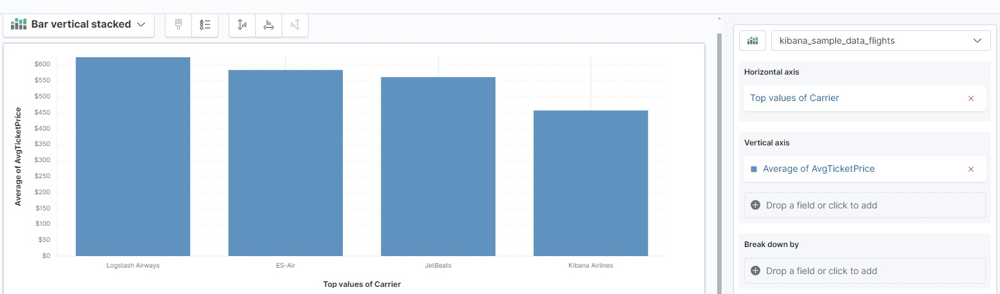

### Tous les avions en provenance de New York qui ont eu du retard ?

OriginCityName : "New York" and FlightDelay: true


### La quantité d’avions ayant eu du retard hier soir entre 21h30 et 22h ?

FlightDelay :true -> Feb 12, 2024 @ 21:30:00.000→Feb 13, 2024 @ 22:00:00.0


### Le prix moyen des billets par compagnie avec une visualisation




### requête pour analyser une erreur dans le code

Cela dépend de ce que vous entendez par "une erreur dans le code". 

Vous pouvez rechercher le code de réponse 500 pour voir les erreurs du serveur : 
```json
{
  "query" : {
    "range" : {
      "response" : {
        "gte" : 500,
        "lte" : 599
      }
    }
  }
}
```

Ou vous pouvez chercher "erreur" dans les journaux (en fonction de ce que vous cherchez). 

```json
{
  "query" : {
    "match" : {
      "message" : "GET"
    }
  }
}
```


### graphique sur le volume de connexion au cours de la journée

- plusieurs solutions sont possibles ici. Si nous voulons connaître le nombre de fois qu'un utilisateur se connecte au site web, nous pourrions suivre le nombre d'adresses IP qui se connectent, classées par heure. Quelque chose comme ça ;

[ip vis](ip-vis.jpg)


### trouver les correspondances possibles pour aller d’une ville A à une ville B entre telle et telle heure ?
- DSL query

```json
{
  "query": {
    "bool": {
      "must": [
        {
          "term": {
            "OriginCityName": "Atlanta"
          }
        },
        {
          "term": {
            "DestCityName": "Mexico City"
          }
        },
        {
          "range": {
            "FlightTimeHour": {
              "gte": 0,
              "lte": 3
            }
          }
        }
      ]
    }
  }
}
```